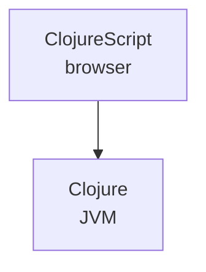
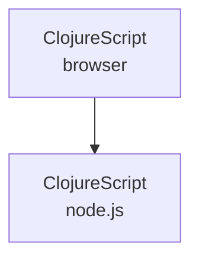

---
defaults:
  layout: center
---

<!--

Traditionally ClojureScript runs on the front-end in the browser.
Probably the most common way to run ClojureScript in the browser today is to use shadow-cljs.


# TODO:
# - [x] put git repo address in talk
# - [x] get the install flow checked with versions
# - [x] Think about nvm isolation and out of date shadowfront for example
# - [ ] Create .node_version file?
# - [ ] Replace shadowfront step with an example folder in the GH repo
# - [ ] Examples of everything
# - [ ] Artifact size comparisons?


# - 6 slides with bullets of pros/cons

Through examples show what these things are, get them running so you can understand the tradeoffs.
Subtext: full stack app with cljs without JVM.

My motivation: full stack js withou the jvm. sitefox is a framework for this. before we get to sitefox we need to understand the different ways to run clojurescript without the JVM and their tradeoffs.

-->

<link rel="stylesheet" href="/style.css"/>

# Full-stack cljs web apps
## with and without Sitefox

By Chris McCormick

chris@mccormick.cx

<!--

Hey, thanks for coming to the workshop today.
My name is Chris and today we are going to look at full-stack
ClojureScript web apps with and without Sitefox.

What full-stack ClojureScript means is that you have ClojureScript
running not just in the browser, but also on the server, on the backend.

Sitefox is the framework I built to give myself a headstart building
ClojureScript back-ends. Hopefully some of you will find it useful,
but at the very least you'll learn about what kinds of things a web
backend needs to do.
-->

---

# Before we start
### Check out the repo


`git clone https://github.com/chr15m/hoc-2024`

<!--
Before we start I'm going to get you to check out the repo for this workshop.
The repo contains these slides and it also contains
an example folder that we will get to soon.

I will leave this QR code and git repo up on the next couple of slides.
-->

---

# Workshop structure

- 30 minutes intro and deps
- 30 minutes = 6 examples
- 30 minutes about Sitefox

<br><br>


`git clone https://github.com/chr15m/hoc-2024`

<!--
This is the structure of today's workshop.

We're going to spend 30 minutes on this current part,
which is the intro and getting dependencies installed.

Then we are going to spend 30 minutes in a whirlwind tour
of different ways to run ClojureScript without using the JVM.

Then we are going to spend 30 minutes looking at Sitefox.
-->

---

# Before we start
### Checking node version

`./check-node-version`

<br>
<br>


`git clone https://github.com/chr15m/hoc-2024`


<!--
Once we have the git repo checked out,
we're going to run this script to check your node version.

If you don't have a recent enough node installed, or any node installed,
it's going to suggest you install nvm or "Node Version Manager".
This is an easy way to install specific versions of node.
If you want to use homebrew or your OS packages that's fine too,
as long as your version of node is recent enough to run the examples.
-->

---

# ClojureScript w/o the JVM

<v-clicks>

- Beyond shadow-cljs
- ClojureScript on the server
- Sitefox framework

</v-clicks>

<footer>
  <code>https://github.com/chr15m/hoc-2024</code>
  <code>./check-node-version</code>
</footer>

<!--
I'm going to crack on with these intro slides but please note the
GitHub repo in the bottom left and the command you need to run in
the bottom right. I'll leave those there and we'll check in with
everyone shortly.

So I want to show you three main things today.

Broadly speaking these three things are about running ClojureScript without depending on the JVM at runtime.

The first thing is about building and running ClojureScript in new ways beyond just shadow-cljs, and the tradeoffs of doing that, including stacks that don't need the JVM at compile time.

The second thing is about running ClojureScript on the back-end, on the server side, or in the cloud, not just in the browser.

The third thing is about my own backend web development framework Sitefox, and how that fits into this puzzle of building ClojureScript web technology.
-->

---

# Going all-in on ClojureScript

### what it means

<footer>
  <code>https://github.com/chr15m/hoc-2024</code>
  <code>./check-node-version</code>
</footer>

<!--
Let's take a closer look at what going full-stack, all-in on ClojureScript means.
-->

---

# Going all-in on ClojureScript



<footer>
  <code>https://github.com/chr15m/hoc-2024</code>
  <code>./check-node-version</code>
</footer>

<!--
This is a simplified view of the traditional way to run ClojureScript and Clojure together.

Here you can see ClojureScript, usually compiled to JavaScript with shadow-cljs these days, or possibly lein and figwheel, and it is running in the browser.

Below that you can see Clojure running on the server, often from a jar file and using the JVM.
-->

---

# Going all-in on ClojureScript



<footer>
  <code>https://github.com/chr15m/hoc-2024</code>
  <code>./check-node-version</code>
</footer>

<!--
What I'm talking about today is this setup.

The frontend is the same, and we've replaced Clojure on the JVM with ClojureScript running on the Node JavaScript VM instead.

What this means in practice is our interop is no longer calling into Java functions and libraries, but now we are calling into JavaScript functions and libraries and leveraging the Node modules ecosystem on the server side.
-->

---

# Full-stack ClojureScript

## why?

<v-clicks>

- Deployment
- Dependencies
- Experience
- Startup
- Unified

</v-clicks>

<footer>
  <code>https://github.com/chr15m/hoc-2024</code>
  <code>./check-node-version</code>
</footer>

<!--
Why would we even want to do this? The JVM is mature and efficient and Clojure was carefully designed to run on top of it. Why would we want to run ClojureScript code on the server backend as well as the browser frontend?

Here are some of the reasons you might want to do this.

Your deployment environment might be optimized for JavaScript. For example we might be deploying to a Platform-as-a-Service like Netlify. Or we might have a legacy internal company architecture that is full optimized for deploying JavaScript on the server.

We might have a dependency on a library that is only available as a node package. Maybe you're working in some niche area and there is no Java library for doing the thing you want, but there is a JavaScript library on npm.

You or your team might have a lot of knowledge and experience built up around the Node ecosystem. You might have more experience with Node and JavaScript than Java and the JVM.

You might be after those fast startup times. The Node VM starts fast.

You might be looking for a more unified frontend and backend experience. A closer match between your front end and backend code and especially the interop environment. For example you might want to import and use the same 3rd party node libraries in the browser and on the server side.

So those are some reasons why we might want to run ClojureScript on the backend as well as the frontend.

-->

---

# Ways to run CLJS (without the JVM)

### Backend

|             | Compiled | Java | Clj data | Reagent |  |
|-------------|----------|------|----------|---------|---|
| shadow-cljs | X        | X    | X        | X       |   |
| nbb         |          |      | X        | X       | X |
| squint      | X        |      |          |         | X |

### Frontend

|             | Compiled | Java | Clj data | Reagent |  |
|-------------|----------|------|----------|---------|---|
| shadow-cljs | X        | X    | X        | X       |   |
| scittle*    |          |      | X        | X       | X |
| squint      | X        |      |          |         | X |

* sitefox & cherry

<!--

Today we're going to take a whirlwind tour of these different technologies for running ClojureScript. I'm going to show you minimal examples of getting each one running.

I've divided these into backend and frontend. You can mix and match these different technologies picking one from the backend list and one from the frontend list. On the backend we have shadow-cljs, nbb, and squint. On the frontend we have again shadow-cljs, squint, and scittle.

We're going to look specifically at the reaons and tradeoffs to help you decide when to pick each one. The tradeoffs are summarized here in the columns.

The "compiled" column tells us whether a particular tool has a compilation step, or if you can deploy and run it directly.

The "Java" column tells us if the tool needs you to have Java installed at compile time. You can see here that shadow-cljs needs Java at compiled time.

The "Clj data" column tells us whether the tool uses Clojure datastructures under the hood, with the immutability guarantees that come with that.

Finally, the "Reagent" column tells us whether we can use the Reagent library. This is important because there's a lot of Reagent knowledge, experience, and probably legacy code lying around. I've indicated Reagent on the backend as well because I think that's a nice advantage - using the same components on the server and client.

Note that where Reagent is not available it means no Clojure libraries are available. So loading any Clojure libraries is out.

Just a couple more notes to finish off.

- First, scittle has an asterisk because Michiel Borkent told me it's technically also possible to run scittle on the backend via webworkers.
- Second, Sitefox is not on here because it's not a tool for running ClojureScript. It's a library that integrates with some of these tools. So it's a different type of beast.
- Finally there is another tool called cherry, which is related to squint, but at this point I think it's not as widely used. I don't know too much about cherry, but it looks like it could one day be a replacement for shadow-cljs in some situations. Unlike squint it uses native Clojure datastructures and compiles to es6 and integrates well with the existing JavaScript ecosystem.

-->

---

# The Goal
## zero to "hello world"
## (tools .forEach)

<!--
What we are going to do today is go from zero to a "hello world" web app using each of the technologies or tools I just showed you.

For each tool we're going to get it running, look at the source code, and also take a look at the tradeoffs.
-->

---

# The examples

- nbb
- shadow frontend
- shadow fullstack
- scittle
- squint
- sitefox (on shadow-cljs)

<!--

These are the six examples we are going to go through.

We have nbb, shadow-cljs frontend, shadow-cljs "full stack", scittle, squint, and finally Sitefox running on shadow-cljs. There's a lot here so let's get started.

-->

---

# nbb
### great for backends

<v-clicks>

```shell
cd examples/nbb
ls
npm install
```

```
package.json
hello.cljs
server.cljs
server_reagent.cljs
```

package.json
```json
{
  "dependencies": {
    "express": "^4.21.0",
    "nbb": "^1.2.192",
    "react": "^17.0.2",
    "react-dom": "^17.0.2"
  }
}
```

</v-clicks>

<!--

Nbb provides an easy way to run ClojureScript on the Node runtime.

The first thing to do, as with all of the following examples, is change into the folder and run `ls` and then `npm install` which will install the dependencies.

There are four files here. The first is a standard Node manifest file `package.json` which describes the dependencies which in this case are nbb itself and express and React which I'll get to.

The goal of nbb is to make it easy to do ad-hoc scripting with ClojureScript on Node.js and the first thing to notice here is that it lives up to that promise. You literally only need a package.json file specifying nbb should be installed and you're ready to go.

The other three files are ClojureScript source examples.

-->

---

# nbb
### great for backends

<v-clicks>

```
npx nbb hello.cljs
```

```
npx nbb server.cljs
```

```
npx nbb server_reagent.cljs
```

</v-clicks>

<!--

The second interesting thing to note is that there is no compile step and the startup time is fast. Go ahead and run `npx nbb hello.cljs` and you'll see it print "hello world" immediately. You can look at the source for that file and see it's just a print statement.

Now take a look at server.cljs - what this does is use Node's express server to stand up a simple webserver. After running it with `npx nbb server.cljs` it runs a simple webserver on port 8000. Visit that page in your web browser to see the hello world string being served.

The final example you can run with `npx nbb server_reagent.cljs`. The main thing to note here is server side Reagent rendering. You need to have React installed to do this because Reagent relies on React. You don't need to install Reagent itself because nbb comes with Reagent pre-compiled.

Notice that I have put a button in the Reagent example, but it doesn't do anything when clicked. This is because we are rendering server side so everything gets turned into plain HTML and of course no event handlers can be found.

-->

---

# nbb
### tradeoffs

<v-clicks>

- easy to get started
- no compile step
- fast startup time
- backend only
- consume Node deps
- consume Clojure deps
- small artifact (1.2Mb JS)
- macros
- reagent available
- no live-reloading built in

</v-clicks>

<!--

Let's talk about the tradeoffs when using nbb.

It's easy to get started with a simple package.json and standard Node tooling.

There's no compile step, you can just run your code directly on Node.

As we've observed it has a fast startup time.

Nbb only runs on the backend on Node, you can't run it in the browser.

You can easily consume Node dependencies as we saw with the `express` web server in the server demo. You just add the deps to your package.json, do `npm install`, and then you can require them.

It's also possible to consume Clojure deps. To do this you need to have babashka installed and you specify the deps in `nbb.edn`. We won't got into this but it's good to bear in mind.

Nbb is distributed as a compiled JavaScript artifact. When you `npm install` it you only pull down 1.2Mb which is pretty good for a node dependency. Of course this is on the server side where artifact size is maybe less important.

Macros are available.

Reagent is built in and you don't have to install it as a dep.

Unlike shadow-cljs there is no built in live-reloading and much of the other extended shadow-cljs tooling is missing. This makes it more suitable for simpler backends.

-->

---

# shadow-cljs
### pure front-end

<v-clicks>

```shell
cd examples/shadow-frontend
ls
npm install
```

```
shadow-cljs.edn
package.json
src/app/core.cljs
public/index.html
```

</v-clicks>

<!--

Now let's switch to the frontend. This is where shadow-cljs has traditionally been used.

We get started in the same way by going into the folder and doing ls and `npm install`.

Looking at the file structure, our setup is a little more complex than nbb. We have the package.json and the source file, which is in the src/app folder.

The package.json this time contains shadow-cljs itself, and React.
We also have a shadow-cljs.edn file. This tells Shadow-cljs where the source is, defines Clojure dependencies, which here is Reagent, and then defines the app build since we are dealing with a compilation phase here.

Finally the index.html is there because this is a frontend app and the browser needs to load something.

-->

---

# shadow-cljs
### pure front-end

<v-clicks>

```
npx shadow-cljs watch app
```

```
npx shadow-cljs release app
```

</v-clicks>

<!--

We run this with `npx shadow-cljs watch app` which sets up the compile and watch loop. Shadow-cljs provides its own dev server and we can visit localhost 8000 to see the page. This time we can click the buttons and the interaction happens as the Reagent rendering is happening in the browser not on the server side.

An interesting thing here is we get all this nice built-in development mode tooling. For example on localhost 9630 we get this dashboard that shows the builds and runtimes and connected browsers. It also has all these nice features like taps and a REPL.

Of course we also get the killer feature of live real-time hot loading of our code changes. When we edit and save the source file we immediately see the changes in the browser.

To compile the app into a production artifact there is this separate build command `npx shadow-cljs release app`. I've set it up here to compile into the build folder.

If we take a look in the build folder we find a main.js artifact that is `275k`. That's a non-trivial amount of JavaScript sent to the frontend. Of course these days there are far heavier JavaScript bundles out there but it is still a non-trivial amount of code for what is a fairly simple interaction.

-->

---

# shadow-cljs frontend
### tradeoffs

<v-clicks>

- more complex setup
- compilation step
- dependent on Java
- slower startup time
- consume Node deps
- consume Clojure deps
- medium sized artifact (275kb JS)
- macros
- reagent available
- great tooling

</v-clicks>

<!--

Let's take a look at the tradeoffs.

The set up is a bit more complex with more files.

There is a compilation step before we can get our code running. This is true both in development and when making a production build. The code has to be compiled before we can run it.

The compile step is depndent on having Java installed.

The startup time for the dev server to get the app compiled and served is on the order of 10 seconds.

We didn't demonstrate this but we can consume Node dependencies. You can add them to package.json and require them just like with nbb on the server side.

We can also consume Clojure deps by putting them into the shadow-cljs.edn dependencies section.

Our artifact size for a Reagent app is medium sized. It's possible to compile very small frontends with shadow-cljs but you have to forgo Reagent and React. You can get even smaller, down to under 10kb, by getting rid of any native Clojure datastructures but you really have to start contorting things to get down there.

We have macros, which are run at compile time via Clojure.

We have Reagent available via the Clojure dependency pathway.

Finally, we have a really good tooling and live-reloading experience.

-->

---

# shadow-cljs
### full stack

<v-clicks>

```shell
cd examples/shadow-fullstack
ls
npm install
```

```
shadow-cljs.edn
package.json
src/app/core.cljs
src/app/server.cljs
public/index.html
```

</v-clicks>

<!--

Now we're going to look at running ClojureScript in the browser and on the server with shadow-cljs. We do this by compiling two different artifacts, one for the client and one for the server. We run the server JavaScript using Node.

Again let's change into the folder, list the files, and npm install the deps.

This time we have a similar setup to the frontend example, but we have an additional file in src/app/server.cljs which of course holds our server code.

To compile this we have a new section in the `shadow-cljs.edn` which specifies how to build the server. Note we've got a different target of `:node-server` and we write it out to devserver.js during watch mode.

Our server.cljs looks similar to the nbb server we looked at before with a couple of differences we'll look at once we get it running.

-->

---

# shadow-cljs
### full stack

```
npx shadow-cljs watch app server
node devserver.js
```

<!--

Let's get this stack running. You can see here we have some additional complexity. Like before we ask shadow-cljs to do the compile and watch loop. This time however we also need to run the server side artifact itself and we do that by using node.

There are different ways to invoke these different processes at the same time and kill them when the dev server is stopped but this does add a bit of complexity since we now have two compiled artifacts.

- test page static rendered
- common component
- no live-reloading of routes
- what if you want to template things?

-->

---

# Sitefox

<!--
Introduction to Sitefox, what is is and why it exists.
- opinionated
- batteries included
-->

---

# Sitefox and nbb

<!--
Using Sitefox with nbb (backend only).
-->

---

# Sitefox and full-stack shadow-cljs

<!--
Using sitefox with full-stack shadow-cljs.
-->

---

# squint
### a new borkdude cljs variant

<!--
Note that there is a more detailed and in depth talk about Squint later in the day by Felix Alm called "a taste of Clojure for JavaScript devs".
-->

---

# scittle
### no-build-step frontends

<!--
When and why to use scittle.
-->

---

# Full-stack cljs web apps
## with and without Sitefox

By Chris McCormick

chris@mccormick.cx

<!--


-->
